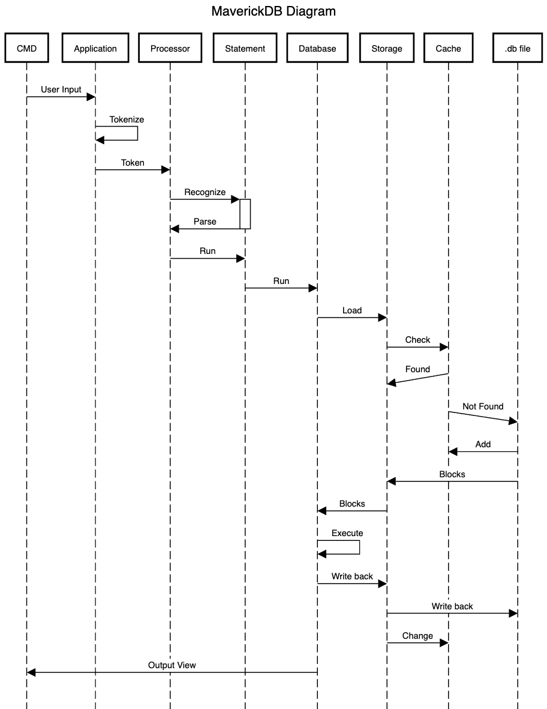

# MaverickDB

## Introduction

This is a course project for ECE141B of University of California San Diego. The main target is to build a MySQL-like relational database from scratch with modern C++(C++ 17). This project was developed for educational purposes. If you are a student in this class, do not directly fork this repo, because this will violate academic integrity.

## Responsibility

- Led the design of an extendable and reliable **relational database** system upon the MVC design pattern in **C++**

- Implemented a complete pipeline including input interpreter, statement validation and 12 types of **SQL** command

- Integrated **indexing** and **caching** system into the database and attained **1.5 times** performance improvement

- Developed own automated testing and validation framework to improve the reliability of the application

## Build

```bash
$ mkdir build
$ cd build
$ cmake ..
$ make
```

If you want to compile the system in debug mode, pass in the following flag to cmake: Debug mode:

```bash
$ cmake -DCMAKE_BUILD_TYPE=Debug ..
$ make
```

## Structure



## File tree

```
.
├── CMakeLists.txt
├── Controller
│   ├── Application.cpp
│   ├── Application.hpp
│   ├── ParseHelper
│   │   ├── Scanner.hpp
│   │   ├── TokenSequencer.cpp
│   │   ├── TokenSequencer.hpp
│   │   ├── Tokenizer.cpp
│   │   └── Tokenizer.hpp
│   ├── Processors
│   │   ├── CmdProcessor.cpp
│   │   ├── CmdProcessor.hpp
│   │   ├── DBProcessor.cpp
│   │   ├── DBProcessor.hpp
│   │   ├── SQLProcessor.cpp
│   │   └── SQLProcessor.hpp
│   └── Statements
│       ├── DBQuery.cpp
│       ├── DBQuery.hpp
│       ├── DBStatement.cpp
│       ├── DBStatement.hpp
│       ├── Filters.cpp
│       ├── Filters.hpp
│       ├── Joins.cpp
│       ├── Joins.hpp
│       ├── SQLStatement.cpp
│       ├── SQLStatement.hpp
│       └── Statement.hpp
├── Model
│   ├── Attribute.cpp
│   ├── Attribute.hpp
│   ├── BPTree
│   │   ├── bpt.cpp
│   │   ├── bpt.hpp
│   │   └── predefined.hpp
│   ├── BlockRetriever.cpp
│   ├── BlockRetriever.hpp
│   ├── Database.cpp
│   ├── Database.hpp
│   ├── Entity.cpp
│   ├── Entity.hpp
│   ├── Index.cpp
│   ├── Index.hpp
│   ├── LRUCache.hpp
│   ├── Row.cpp
│   ├── Row.hpp
│   └── Storage
│       ├── BlockIO.cpp
│       ├── BlockIO.hpp
│       ├── Storage.cpp
│       └── Storage.hpp
├── README.md
├── Tests
│   ├── Faked.cpp
│   ├── Faked.hpp
│   ├── ScriptRunner.hpp
│   ├── TestAutomatic.hpp
│   ├── TestManually.hpp
│   └── TestSequencer.hpp
├── Utility
│   ├── AboutMe.hpp
│   ├── BasicTypes.hpp
│   ├── Compare.hpp
│   ├── Config.hpp
│   ├── Errors.hpp
│   ├── FolderReader.hpp
│   ├── Helpers.hpp
│   ├── Timer.hpp
│   └── keywords.hpp
├── View
│   ├── TabularView.cpp
│   ├── TabularView.hpp
│   └── View.hpp
├── final.txt
├── main.cpp
└── src
```

## Supported Statements

### Application Statement

```mysql
version; # Version 1.0
help; # Help system available
quit; # DB::141 is shutting down
```

### DBStatement

#### Create database statement

```mysql
CREATE DATABASE testing1;
Query OK, 1 row affected (0.01 secs)  
```

#### Drop database statement

```mysql
DROP DATABASE {db-name}
Query OK, 0 rows affected (0.00)  
```

#### Show databases statement

```mysql
> show databases;
+--------------------+
| Database           |
+--------------------+
| foo                |
| bar                |
| wiltz              |
+--------------------+
3 rows in set (0.02 sec)
```

#### Use database statement

```mysql
> use testing;
Database changed
```

#### Dump database statement

```mysql
> dump database testdb;
+----------------+--------+---------------+
| Type           | Id     | Extra         |
+----------------+--------+---------------+
| Meta           | 0      |               |
-----------------+--------+---------------+
| Entity         | 1      | Users         |
-----------------+--------+---------------+
| Data           | 1      | Users         |
-----------------+--------+---------------+
| Free           | 0      |               |
-----------------+--------+---------------+
| Data           | 3      | Users         |
-----------------+--------+---------------+
5 rows in set (0.02 sec)
```

### SQLStatement

#### Create table statement

```mysql
> CREATE TABLE tasks (
  	id INT AUTO_INCREMENT PRIMARY KEY,
  	title VARCHAR(100) NOT NULL,
  	price FLOAT DEFAULT 0.0,
  	status BOOLEAN DEFAULT FALSE,
	)
Query OK, 1 row affected (0.002 sec)
```

#### Show tables statement

```mysql
> show tables;
+----------------------+
| Tables_in_mydb       |
+----------------------+
| groups               |
| users                |
+----------------------+
2 rows in set (0.000025 sec.)
```

#### Drop table statement

```mysql
> drop table groups;
Query OK, 0 rows affected (0.02 sec)
```

#### Describe table statement

```mysql
> DESCRIBE tasks;
+-----------+--------------+------+-----+---------+-----------------------------+
| Field     | Type         | Null | Key | Default | Extra                       |
+-----------+--------------+------+-----+---------+-----------------------------+
| id        | integer      | NO   | YES | NULL    | auto_increment primary key  |
| title     | varchar(100) | NO   |     | NULL    |                             |
| price     | float        | YES  |     | 0.0     |                             |
| due_date  | date         | YES  |     | NULL    |                             |
| status    | boolean      | YES  |     | FALSE   |                             |
+-----------+--------------+------+-----+---------+-----------------------------+
5 rows in set (0.000043 sec.)

```

#### Insert statement

```mysql
INSERT INTO users 
  ('first_name', 'last_name', 'email') 
VALUES 
  ('David','He', 'dyhe@ucsd.edu'),
  ('Sai', 'Komatineni', 'saikomatineni@engucsd.edu');
```

#### Select statement

```mysql
> SELECT * from Users;
+--------------------+--------------+
| id  | first_name   | last_name    |
+-----+--------------+--------------+
| 1   | david        | he           |
| 3   | rick         | gessner      |
+-----+--------------+--------------+
3 rows in set (0.00231 sec)
```

```mysql
> SELECT id, first_name, last_name, zipcode from Users where zipcode>92120 order by zipcode LIMIT 2
+--------------------+--------------+--------------+
| id  | first_name   | last_name    | Zipcode      |
+-----+--------------+--------------+--------------+
| 3   | Anirudh      | Swaninthan   | 92126        |
| 1   | Pu           | Cheng        | 92127        |
+-----+--------------+--------------+--------------+
2 rows in set (0.00123 sec)
```

```mysql
> select last_name, title from Authors left join Books on Authors.id=Books.author_id;
+-----------+-------------------------------------------+
| last_name | title                                     |
+-----------+-------------------------------------------+
| Rowling   | Harry Potter and the Sorcerer's Stone     |
| Rowling   | Harry Potter and the Philosopher's Stone  |
| Rowling   | Harry Potter and the Prisoner of Azkaban  |
| Rowling   | Harry Potter and the Chamber of Secrets   |
| Rowling   | Harry Potter and the Goblet of Fire       |
| Rowling   | Harry Potter and the Order of the Phoenix |
| Rowling   | Harry Potter and the Half-Blood Prince    |
| King      | Carrie                                    |
| King      | The Dark Tower                            |
| King      | The Green Mile                            |
| Nguyen    | NULL                                      |
+-----------+-------------------------------------------+
11 rows in set (0.00 sec)
```

#### Update statement

```mysql
UPDATE Users SET "zipcode" = 92127 WHERE zipcode>92100;
Query Ok. 2 rows affected (0.000087 sec)
```

#### Delete statement

```mysql
DELETE from Users where zipcode>92124;
Query Ok. 1 rows affected (0.000023 sec)
```

#### Alter statement

```mysql
ALTER TABLE Books add pub_year varchar(4);  
Query Ok, 20 rows affected (0.00123 secs)
```

#### Run script statement

```mysql
run script test; # will run scripts of test.txt file in the root folder
```


